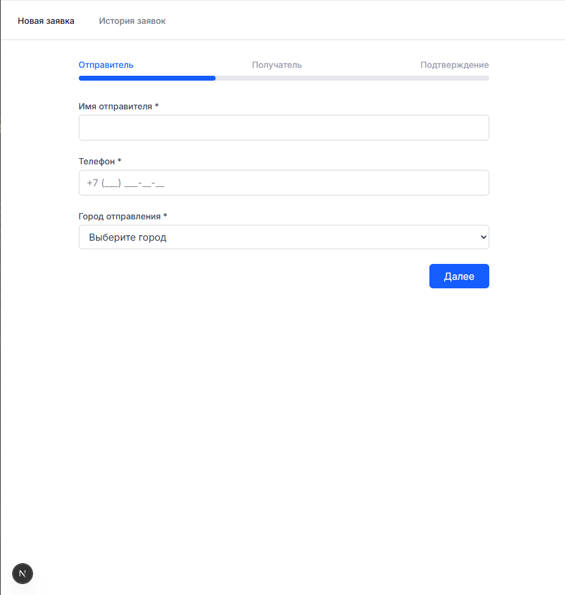

# Доставка Посылок - Мини-приложение для оформления заявок

Веб-приложение для оформления заявок на доставку посылок с многошаговой формой и историей заявок. Разработано на Next.js с использованием TypeScript и Tailwind CSS.

## 📋 Функциональность

### Основные возможности

#### Форма оформления заявки (3 шага)

**Шаг 1 - Отправитель**

- Имя (обязательное, минимум 2 символа)
- Телефон (обязательный, с маской ввода +7 (**_) _**-**-**)
- Город отправления (обязательный, выпадающий список)

**Шаг 2 - Получатель и посылка**

- Имя получателя (обязательное)
- Город назначения (обязательный, не может совпадать с городом отправления)
- Тип груза: документы / хрупкое / обычное
- Вес, кг (обязательный, от 0.1 до 30 кг)

**Шаг 3 - Подтверждение**

- Сводка всех введенных данных (режим только для чтения)
- Чекбокс согласия с условиями (обязательный)
- Кнопка отправки

**Навигация**

- Прогресс-бар / степпер показывает текущий шаг
- Кнопки "Назад" / "Далее" с сохранением данных при возврате
- Автосохранение черновика в localStorage

#### История заявок (/orders)

- Список всех оформленных заявок из localStorage
- Карточка заявки содержит: откуда → куда, имя отправителя, тип груза, дату создания, статус
- Поиск по имени получателя и городу назначения
- Фильтрация по типу груза
- Удаление заявки с кастомным диалогом подтверждения
- При клике на заявку - детальная страница с полной информацией

## 🛠 Технологии

- **Next.js 14** (App Router)
- **TypeScript** - полная типизация
- **Tailwind CSS** - стилизация без UI-библиотек
- **Zod** - валидация форм
- **localStorage** - хранение данных

## 🚀 Установка и запуск

1. **Клонирование репозитория**

   ```bash
   git clone https://github.com/stepGT/this_next_delivery
   cd delivery-orders
   
   ## Запуск в режиме разработки
   npm run dev
   
   ## Сборка для продакшена
   npm run build
   npm start
   ```

   